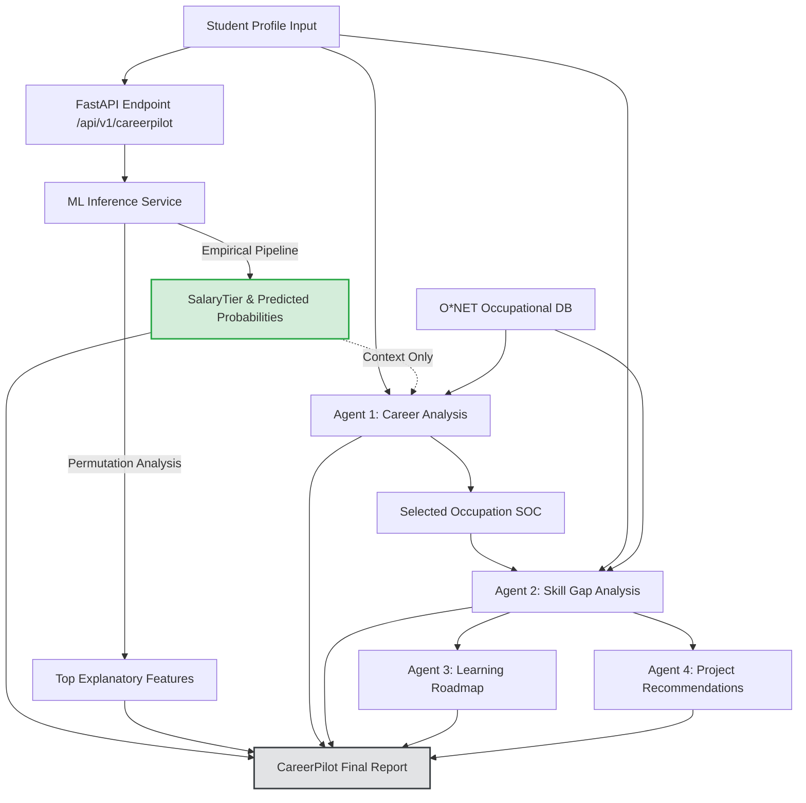

# Phase 3 Architecture: CareerPilot AI Modular Monolith

## 1. System Overview

CareerPilot AI Phase 3 integrates an empirical, trained machine learning model with occupational knowledge from O*NET and deterministic agentic AI powered by Google Gemini. The application is implemented as a clean modular monolith consisting of:

1. **Empirical ML Inference Layer** (`backend/app/services/ml_service.py`):
   - Loads the validated Logistic Regression pipeline (`ml/models/final_model.joblib`) trained on the Aspiring Minds' Employment Outcomes 2015 (AMEO 2015) dataset.
   - Primary Zenodo Record: DOI `10.5281/zenodo.45735`, licensed under **CC BY-NC-SA 4.0** (Creative Commons Attribution-NonCommercial-ShareAlike 4.0 International).
   - Strictly owns the statistical prediction of `SalaryTier` (Low, Mid, High) and predicted class probabilities.
   - **No Career Suitability Claims**: The ML model predicts an employment outcome variable (`SalaryTier`). It does NOT predict a student's "best career", "ideal career", "career suitability", or "career success".
   - **Probability Terminology**: Probabilities are raw predicted probabilities from `LogisticRegression.predict_proba()`. No post-hoc probability calibration procedure (e.g. Platt scaling, isotonic regression) was conducted; therefore, outputs are strictly termed "predicted probabilities", never "calibrated probabilities" or "confidence scores".
   - Provides global permutation feature importance explanations.
   - **Architectural Invariance**: The ML output is authoritative and can never be modified, overridden, or synthesized by downstream LLM agents.

2. **Occupational Knowledge Base** (`backend/app/services/onet_service.py`):
   - Curated O*NET occupational data for 10 engineering-relevant SOC codes stored locally (`data/onet/occupations.json`).
   - Sourced from the U.S. Department of Labor O*NET OnLine / O*NET 28.0 Database (CC BY 4.0). See [`docs/ONET_PROVENANCE.md`](file:///c:/Users/nilay/Desktop/PROJECTS/CareerPilot-AI/docs/ONET_PROVENANCE.md).
   - Provides canonical skills, knowledge areas, technical tools, and typical tasks.

3. **Deterministic Agentic Layer** (`backend/app/services/agent_service.py`):
   - Four sequential, single-responsibility agents:
     - **Career Analysis Agent**: Suggests occupational exploration areas based on student specialization and profile strengths. Does NOT rank occupations merely by salary tier.
     - **Skill Gap Agent**: Cross-references student profile against O*NET occupational standards to identify objective skill gaps.
     - **Learning Roadmap Agent**: Sequences identified skill gaps into phased, actionable milestones.
     - **Project Recommendation Agent**: Proposes concrete, resume-worthy portfolio projects to close identified skill gaps.
   - Strictly validates all model responses against strict Pydantic schemas.
   - Graceful fallback mode ensures full offline/free-tier reliability even without a Gemini API key.

4. **API Gateway & Routing** (`backend/app/api/routes.py`, `backend/app/main.py`):
   - FastAPI application serving interactive OpenAPI docs (`/docs`).
   - Endpoints for health checks, standalone ML predictions, modular agent calls, and end-to-end report generation.

5. **Client Application** (`frontend/`):
   - Next.js / React / TypeScript dashboard offering intuitive student profile input, explicit ML employment outcome prediction cards, feature association visualizers, and interactive roadmap views.

---

## 2. Architectural Flow Diagram

---

## 3. Strict Separation of ML and Agentic AI

| Dimension | Machine Learning (AMEO 2015) | Agentic AI (Gemini + O*NET) |
| :--- | :--- | :--- |
| **Responsibility** | Predicts early-career `SalaryTier` (Low, Mid, High) and predicted probabilities. | Interprets profile strengths, compares against O*NET, builds learning roadmaps and projects. |
| **Data Authority** | Empirical AMEO 2015 dataset (Zenodo DOI: `10.5281/zenodo.45735`, CC BY-NC-SA 4.0). | O*NET Content Model (v28.0) + Curated JSON (CC BY 4.0). |
| **Suitability Assertion** | **None**. Does not determine career suitability or ideal occupation. | Explores occupational avenues aligned with student background and O*NET skill overlap. |
| **Modification Rights** | Sole authority for statistical prediction. | Read-only consumer. Cannot override, adjust, or re-tier the prediction. |
| **Dependence** | Zero cloud dependence. Runs locally via `scikit-learn` and `joblib`. | Free-tier Gemini API with deterministic rule-based fallback when offline. |
| **Attribution** | Zenodo DOI: `10.5281/zenodo.45735` (CC BY-NC-SA 4.0). | O*NET OnLine (CC BY 4.0) + AI guidance disclaimer. |

---

## 4. API Endpoints

| Method | Endpoint | Description | Requires Gemini |
| :--- | :--- | :--- | :--- |
| `GET` | `/health` | System health check (ML pipeline, O*NET DB, Gemini config). | No |
| `GET` | `/api/v1/health` | Versioned health check. | No |
| `GET` | `/api/v1/occupations` | List all 10 curated O*NET engineering occupations. | No |
| `GET` | `/api/v1/occupations/{soc}` | Fetch detailed O*NET profile by SOC code. | No |
| `POST` | `/api/v1/predict` | Standalone ML inference returning `SalaryTier`, probabilities, and feature importances. | **No** |
| `POST` | `/api/v1/career-analysis` | Agent 1: Explores occupational fits based on profile and ML tier. | Optional (has fallback) |
| `POST` | `/api/v1/skill-gap` | Agent 2: Identifies verified strengths and missing target skills. | Optional (has fallback) |
| `POST` | `/api/v1/roadmap` | Agent 3: Produces a structured 3-phase learning roadmap. | Optional (has fallback) |
| `POST` | `/api/v1/projects` | Agent 4: Recommends hands-on portfolio projects. | Optional (has fallback) |
| `POST` | `/api/v1/careerpilot` | Full workflow endpoint generating the complete structured report. | Optional (has fallback) |

---

## 5. Agent Responsibilities & Prompt Engineering

### Agent 1: Career Analysis Agent
- **Inputs**: Student degree, specialization, college tier, AMCAT scores, Big-5 personality traits, ML predicted `SalaryTier`.
- **Outputs**: 2–3 suggested O*NET occupations, relevant profile strengths, and rationale.
- **Rule**: Must cite actual candidate attributes and link to valid O*NET SOC codes.

### Agent 2: Skill Gap Agent
- **Inputs**: Student profile attributes, target occupation SOC code, and O*NET skill inventory.
- **Outputs**: Categorized lists of current strengths vs. identified skill gaps with priority ratings (High / Medium / Low).
- **Rule**: Gaps must derive directly from O*NET knowledge/skill requirements.

### Agent 3: Learning Roadmap Agent
- **Inputs**: Identified skill gaps, target occupation title, student time commitment preference.
- **Outputs**: 3-phase curriculum (Foundations, Core Competencies, Applied Mastery) with verifiable milestones.
- **Rule**: Does not fabricate external proprietary URLs. Focuses on core competencies and conceptual mastery.

### Agent 4: Project Recommendation Agent
- **Inputs**: Target occupation, identified skill gaps, candidate specialization.
- **Outputs**: 2–4 practical, resume-ready projects with defined objectives, tech stack, and deliverable criteria.
- **Rule**: Projects must directly bridge at least one high-priority skill gap.

---

## 6. Privacy & Safety Guarantees

1. **Zero Data Retention**: The backend does not persist student profile submissions to any database or local log files by default.
2. **PII Sanitization**: Student names, email addresses, phone numbers, and institution names are neither requested nor passed to external LLM APIs.
3. **Transparent Uncertainty**: Every prediction includes model probabilities and an explicit statement that AMEO 2015 historical data reflects historical market patterns, not guarantees of future outcomes.
4. **Deterministic Resilience**: If the Gemini API key is unset, expires, or hits free-tier rate limits, all endpoints fall back to deterministic, rule-based heuristics derived from O*NET mappings without throwing 500 errors.

---

## 7. Limitations & Honest Disclosures

- **Dataset Demographics**: AMEO 2015 reflects Indian engineering graduates entering the job market between 2010 and 2015. Tech market salaries and industry demands have evolved significantly.
- **O*NET Alignment**: O*NET data is established for the U.S. labor market by the Department of Labor. While foundational engineering competencies remain globally applicable, specific regional certification or regulatory nuances may differ.
- **Correlation vs. Causation**: Feature importances describe statistical associations in the training sample and must not be misinterpreted as causal mechanisms.
