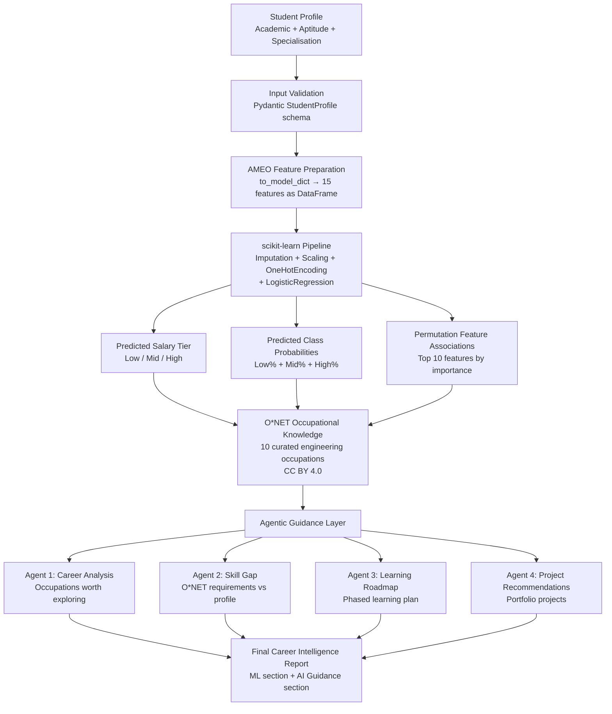

# CareerPilot AI — System Architecture

**Version:** 3.0.0  
**Architecture Pattern:** Modular Monolith  

---

## 1. Architecture Summary

CareerPilot AI is a **modular monolith** — not microservices. All backend logic runs within a single FastAPI application process. The codebase is divided into clearly separated modules (ML, agents, O*NET, API routing) that communicate through internal function calls and Pydantic-validated data contracts.

---

## 2. High-Level Data Flow



---

## 3. Component Architecture

### 3.1 Frontend (Next.js)

| Component | Technology | Purpose |
|---|---|---|
| Framework | Next.js 16.3.8 (Turbopack) | SSR/CSR React application |
| Language | TypeScript 5 | Type-safe frontend |
| UI Library | React 19 | Component rendering |
| Styling | Vanilla CSS with CSS variables | No framework dependency |
| API Client | `fetch` via `src/services/api.ts` | HTTP calls to FastAPI backend |
| Type Contracts | `src/types/careerpilot.ts` | Mirrors backend Pydantic schemas |

**12 dedicated page experiences:**
- Dashboard, Profile, Assessment, ML Outcome, Model Explanation
- Career Exploration, Career Detail
- Skill Gap, Roadmap, Project Recommendations
- Final Report, About / Methodology

### 3.2 Backend API (FastAPI)

| Component | Technology | Purpose |
|---|---|---|
| Framework | FastAPI ≥ 0.110 | Async HTTP API |
| ASGI Server | Uvicorn | Production-grade ASGI server |
| Validation | Pydantic v2 | Schema validation + serialisation |
| Configuration | pydantic-settings | Environment-based config |

**API Endpoints (`/api/v1/`):**

| Method | Path | Purpose | Requires Gemini? |
|---|---|---|---|
| GET | `/health` | System status | No |
| POST | `/predict` | ML-only salary tier prediction | No |
| POST | `/career-analysis` | Agent 1: career suggestions | Optional |
| POST | `/skill-gap` | Agent 2: gap analysis | Optional |
| POST | `/roadmap` | Agent 3: learning roadmap | Optional |
| POST | `/projects` | Agent 4: project recommendations | Optional |
| POST | `/careerpilot` | Full end-to-end workflow | Optional |
| GET | `/occupations` | List all O*NET occupations | No |
| GET | `/occupations/{soc_code}` | Get single occupation | No |

### 3.3 ML Layer

| Component | Path | Purpose |
|---|---|---|
| Trained pipeline | `ml/models/final_model.joblib` | Serialised sklearn Pipeline |
| Model metadata | `ml/models/model_metadata.json` | Feature list, thresholds, metrics |
| Inference service | `backend/app/services/ml_service.py` | Thread-safe prediction |
| Feature importances | `docs/reports/permutation_importances.csv` | Pre-computed permutation scores |

**sklearn Pipeline steps:**
1. `ColumnTransformer`:  
   - Numerical: `SimpleImputer(median)` → `StandardScaler`  
   - Categorical: `SimpleImputer(constant='Unknown')` → `OneHotEncoder(handle_unknown='ignore')`
2. `LogisticRegression(C=0.1, solver='lbfgs', max_iter=500, multi_class='multinomial')`

### 3.4 O*NET Data Layer

| Component | Path | Purpose |
|---|---|---|
| Occupation data | `data/onet/occupations.json` | Curated local O*NET dataset |
| O*NET service | `backend/app/services/onet_service.py` | Loading + querying |
| Provenance | `docs/ONET_PROVENANCE.md` | Attribution and curation record |

The O*NET dataset is a **curated local copy** of 10 engineering occupations extracted from the O*NET 28.0 Database. No live O*NET API calls are made at runtime, eliminating external network dependencies.

### 3.5 Agent Layer

| Component | Path | Purpose |
|---|---|---|
| Agent service | `backend/app/services/agent_service.py` | All 4 agents + fallback logic |
| Gemini model | `gemini-1.5-flash` | Optional AI guidance |
| Pydantic schemas | `backend/app/schemas.py` | Validated agent output contracts |

All Gemini responses are:
1. Required to return valid JSON
2. Parsed against a strict Pydantic schema
3. Retried once with correction instructions if validation fails
4. Replaced with deterministic fallback logic if both attempts fail

### 3.6 Offline Fallback Architecture

```
Gemini Available?
    YES → Gemini generates response → Pydantic validation → serve
           └── Validation fails → retry with correction → serve
               └── Retry fails → fallback → serve
    NO  → Deterministic rule-based fallback → serve
```

The fallback is not a degraded experience — it is a genuinely functional alternative grounded in O*NET skill lists and the student's profile data.

---

## 4. Security & Privacy

- **No PII collected**: The profile form does not ask for name, email, phone, or address.
- **Entrance exam data**: Collected for career context only; strictly excluded from the ML feature vector.
- **Gemini prompts**: Only anonymised academic/aptitude summaries are sent to Gemini — never raw profile fields.
- **API key security**: Gemini API key stored in `.env` file, never exposed to the frontend.
- **No database**: No persistent user data storage is implemented. All data exists only for the duration of a session.

---

## 5. Dependency Graph

```
frontend/                          backend/
  src/services/api.ts    ────────→   app/api/routes.py
  src/types/careerpilot.ts             ↕
                                   app/schemas.py (Pydantic contracts)
                                     ↕         ↕           ↕
                               ml_service   agent_service  onet_service
                                    ↕              ↕
                          final_model.joblib   google.generativeai
                          model_metadata.json  (optional)
                                               data/onet/occupations.json
```

---

## 6. Configuration

All configuration is loaded from environment variables (`.env` file at project root):

| Variable | Default | Purpose |
|---|---|---|
| `GEMINI_API_KEY` | `""` (empty) | Enables Gemini AI — optional |
| `GEMINI_MODEL` | `gemini-1.5-flash` | Which Gemini model to use |
| `ENVIRONMENT` | `development` | Runtime environment |
| `BACKEND_PORT` | `8000` | FastAPI listen port |
| `CORS_ORIGINS` | localhost:3000 | Allowed frontend origins |

When `GEMINI_API_KEY` is empty, the system runs in offline/fallback mode automatically.

---

## 7. What This Architecture Is NOT

- **Not microservices**: All backend services run in one process.
- **Not a cloud deployment**: Designed to run locally; no production cloud infrastructure is claimed.
- **Not a database-backed system**: No Supabase, PostgreSQL, or any persistence layer is implemented.
- **Not an LLM-first system**: Gemini is an optional interpretation layer, not the ML prediction engine.
